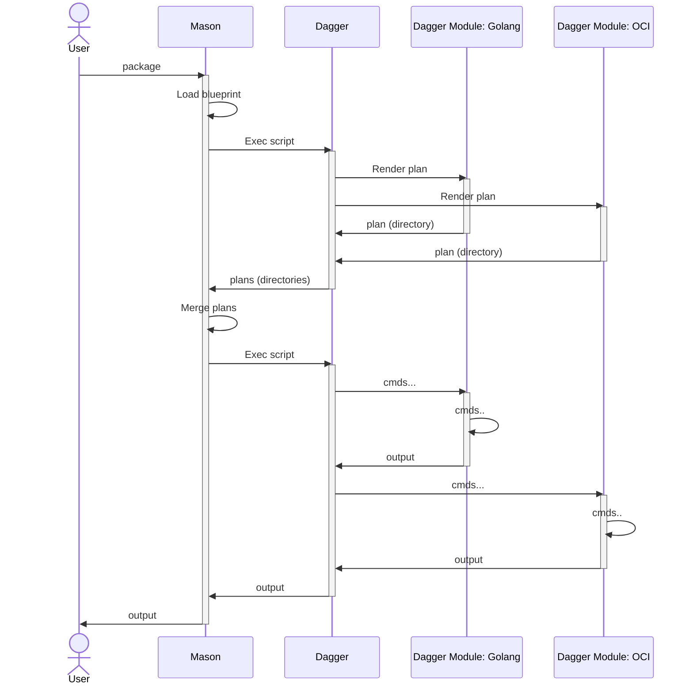

# Mason

[](https://deepwiki.com/vbehar/mason)

**Declarative build tool based on [Dagger](https://dagger.io/).**

[](https://asciinema.org/a/719109)

## Overview

**Mason** aims to provide:
- a **simple and consistent CLI/UX** for building and testing software. Just run `mason package` in any project to produce artifacts, or `mason test` to run tests.
- a **declarative and modular configuration**. Just drop a new YAML file to start producing a new artifact.
- an **extensible and language-agnostic architecture**. `mason` - the CLI - is just a coordinator. All the "build" logic is implemented in **modules**, which you can reuse or create.
- a **sandboxed and cached execution environment**. Everything runs in containers, isolated from the host system. No more "magic environment variables" or "hidden dependencies". Everything is explicit and reproducible.

It is inspired by:
- [Maven](https://maven.apache.org/) for its **phases** - which are common to all projects. *Convention over configuration*.
- [GoReleaser](https://goreleaser.com/) and [Kubernetes](https://kubernetes.io) for their **declarative configuration**.
- [Dagger](https://dagger.io/) for its **modules**.

As a user, you write small YAML files describing an expected state, such as:

```yaml
kind: GoBinary
moduleRef: github.com/vbehar/mason-modules/golang@v0.0.1
metadata:
  name: mason-linux-amd64
spec:
  os: linux
  arch: amd64
  output:
    hostFilePath: bin/mason-linux-amd64
```

or 

```yaml
kind: GoTest
moduleRef: github.com/vbehar/mason-modules/golang@v0.0.1
metadata:
  name: mason-unit-tests
spec:
  output:
    junitHostFilePath: tests-junit-report.xml
```

And then, you can run:
- `mason package` to build the binaries
- `mason test` to run the tests

It is written in [Go](https://golang.org/) on top of [Dagger](https://dagger.io/). Thus, it benefits from all the features of Dagger, such as:
- **modularity**: easily re-use the existing [Dagger modules](https://daggerverse.dev/) or create your own
- **language-agnostic**: Dagger modules can be written in quite a few different languages (`go`, `python`, `typescript`, `php`, `java`, etc), and you can interact with them using the same API
- **sandboxed**: all operations are isolated in containers
- **caching**: Dagger caches the results of operations, making it faster to run the same operations multiple times

### Core Concepts

#### Blueprint

A **blueprint** is a collection of declarative build definitions written in YAML or JSON. It describes the expected outputs (binaries, container images, etc.), and how to produce them. Just like architectural blueprints, it's the plan from which everything is built.

#### Brick

A **brick** is a single unit of work within a blueprint. Each brick defines:

* A `kind` (e.g. GoBinary, GoTest, GoLint, OCIImage, RunBinary, etc)
* A reference to the module that can process it (`moduleRef`)
* `metadata` for name, labels and other information common to all bricks
* A `spec` that describes the expected state or build parameters. This is specific to each `kind` and is defined by the modules.

Example:

```yaml
kind: GoBinary
moduleRef: github.com/vbehar/mason-modules/golang@v0.0.1
metadata:
  name: mason-linux-amd64
  labels:
    os: linux
    arch: amd64
spec:
  os: linux
  arch: amd64
  output:
    daggerFileName: mason_linux_amd64
    hostFilePath: bin/mason-linux-amd64
```

#### Module

A **module** is a [Dagger module](https://docs.dagger.io/api/module-structure/) that defines how to process one or more kinds of bricks. Modules are language-agnostic and reusable. They:

* Define brick schemas (what's allowed in `spec`)
* Receive a blueprint
* **Render a plan**: a Dagger script that Mason will execute

#### Phases

A **phase** is a step in the "build" pipeline. Mason provides a set of common phases that can be used in any project:
* `test`: run the tests
* `lint`: run the linters
* `package`: package the artifacts (binaries, container images, etc.)
* `publish`: publish the artifacts (to a registry, etc.)
* `run`: run the artifacts

But it is not limited to that. You can create your own phases if you prefer. Phases are defined by the **modules**: each module will produce 1 Dagger script per phase and brick.

##### Aliases

An **alias** is a shortcut for running one or more phases, potentially with selectors to filter the bricks. Aliases are defined in a configuration file, which can either be stored in the project alongside the bricks, or on a per-user basis.

#### Plan

A **plan** is a Dagger script that defines the operations to run. It is generated by the modules based on the blueprints and the selected phases. The plan is executed by Dagger, to produce the expected outputs.

### Why Mason?

I wrote a blog post on that topic: [Mason: a declarative build tool on top of Dagger](https://whtwnd.com/vbehar.dev/3lp2uqrwpbo2i).

TL;DR as tried to spread the usage of Dagger at work, I found some limitations in its current form. Mainly the lack declarative configuration and the complexity of running "tasks". Mason is my attempt to solve these issues...

## Getting Started

### Installation

For the moment, the easiest way to install Mason is to use `go install`:

```bash
go install github.com/vbehar/mason@latest
```

This will install the latest version of Mason in your `$GOPATH/bin` directory. Make sure to add this directory to your `PATH` if it's not already there.

### Dependencies / Requirements

* [Dagger](https://dagger.io/)
* Access to a [Docker](https://docker.com/) daemon

Mason requires the Dagger CLI to be installed.

### Configuration

Mason can be configured:
* through one or more YAML files. Run `mason config locations` to see the list of files that will be used. Run `mason config` to see the current configuration.
* through environment variables. Run `mason config` to see the list of environment variables that will be used.
* through command line arguments. Run `mason --help` to see the list of available commands and options.

### Usage

To get started with Mason, the easiest way is to use `mason` to build itself:
1. Clone this repository: `git clone https://github.com/vbehar/mason`
2. You can inspect the `.mason` directory to see the configuration (`config.yaml`) and the bricks.
3. Run `go run . validate` to run the tests, lint the code, package the binaries, and run the "version" command in a container.
4. Run `go run . validate -vvv` to add verbosity, and see the Dagger scripts that are generated and executed.
5. Read the code of the modules used to build the project. They are located at [github.com/vbehar/mason-modules](https://github.com/vbehar/mason-modules).

## How it works

Mason is a wrapper around Dagger, and it relies heavily on the Dagger Shell feature, to run Dagger scripts.

A simplified sequence diagram to package 2 different artifacts (a Go binary and a container image) is shown below:



For each phase, Mason will call Dagger twice:
1. with a script to generate the **plan**, similar to:
```shell
directory |
  with-directory golang $(github.com/vbehar/mason-modules/golang@v0.0.1 | render-plan .mason/.work/abc/def/blueprint/golang) |
  with-directory run $(github.com/vbehar/mason-modules/run@v0.0.1 | render-plan .mason/.work/abc/def/blueprint/run) |
  export /path/to/mason/.mason/.work/abc/def/plan
```
2. with a "merged" script - containing all the scripts from all the modules - to execute the plan, similar to:
```shell
mason_linux_amd64=$(github.com/vbehar/mason-modules/golang@v0.0.1 --source $(host | directory .) | build-binary --go-os linux --go-arch amd64 --output-file-name mason_linux_amd64)
$mason_linux_amd64 | export bin/mason-linux-amd64

container --platform linux/amd64 | from cgr.dev/chainguard/wolfi-base | with-file /usr/local/bin/mason $mason_linux_amd64 | with-exec /usr/local/bin/mason version | stdout
```

This approach allows developers to write powerful Dagger scripts in any language. These scripts can then use zero, one or more modules to produce the expected outputs.

And because all the scripts are merged together into a single one, it is possible to use the output of one script as the input of another one, by using variables and Dagger core types, such as `directory`, `file`, `container`, etc. In the previous example, one script defines a `mason_linux_amd64` variable, which is then used in the second script to create a container.

To make sure that the scripts are merged correctly, Mason orders them in a DAG (Directed Acyclic Graph), based on the variables definitions and usages. This way, we don't need to explicitly define the dependencies between the scripts.

## Writing Mason modules

A Mason module is a Dagger module with 1 mandatory function: `render-plan`:
* **input**: a Dagger directory, representing the blueprint. It contains 1 JSON file per brick, that the module will process.
* **output**: a Dagger directory, containing zero or more files, which are the Dagger scripts to execute.
  * Each file must be named `<phase>_<something>.dagger`, so that Mason can then easily filter the files by phase, and merge them.
  * Examples: `package_mason_linux_amd64.dagger`, `package_mason_linux_arm64.dagger`, `run_mason_linux_arm64.dagger`, etc.

See [github.com/vbehar/mason-modules](https://github.com/vbehar/mason-modules) for examples of modules.

## Roadmap

* post-run reporters, to report result/status to an external system, or to analyze the results with an LLM
* multi-workspace support - for monorepos

## Contributing

Feel free to open issues or PRs. We are happy to accept contributions, and we will try to review them as soon as possible.
